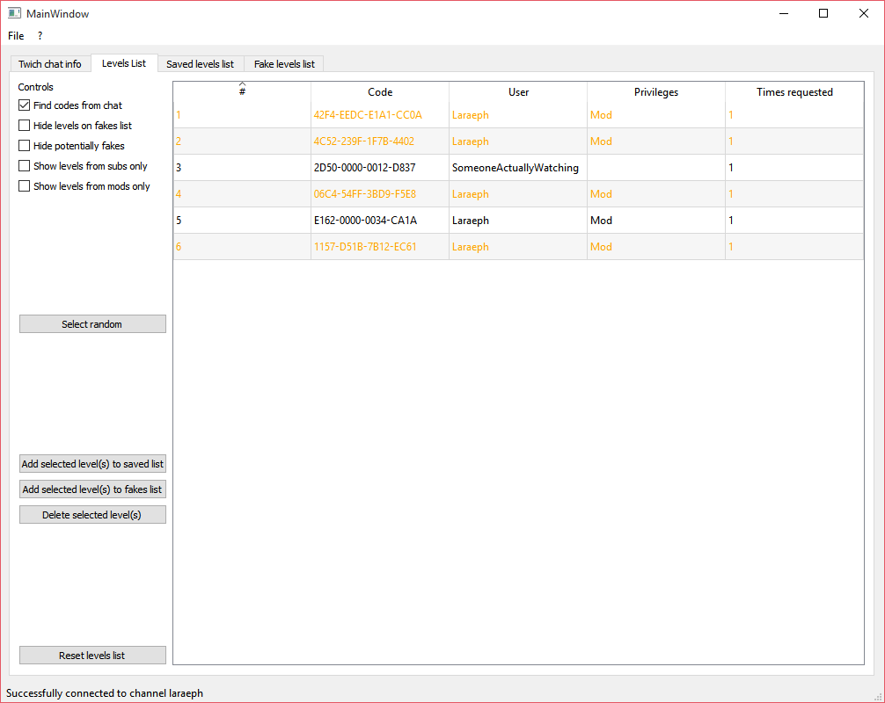

# MarioMakerLevelsBot
Pulls Mario Maker levels from Twitch chat into a pretty interface.

Connect to your Twitch chat channel using the program and start finding codes to see the list auto-populate.

## Code filtering or sorting
Because the chat may be spammed with many level codes, basic filtering options are available:

- Hide levels that are on a special "fake list", that you have created (shown in red in the list)
- Hide levels that have been determined to be likely fake by the program (shown in orange in the list)
- Show only levels from subsribers or mods or both

All columns can be sorted by: date submitted, code, user that submitted the level, priviledges (sub/mod) and times submitted (for those times you're asking for a specific level and hoping most people in chat will post the correct one).

## Random selection
For those times you don't know which level to play, you can have the program select a random one for you, filters taken into account.

## Saving levels and marking them as fake
Two extra lists are available: those are not pulled from Twitch chat, but saved on your computer between uses.

- The saved list is designed for you to save levels you found interesting or mean to play in the future.
- The fakes list is designed so you can add codes you know are fake and may come back often (and are not detected by the program as potentially fake), to force them to be marked as fake (red).

# How to set-up
## Download
Compiled and ready to run (on Windows) version are available [in the releases](https://github.com/RLejolivet/MarioMakerLevelsBot/releases).
Alternatively, you may compile the project from source using Python3.4, PySide and cx_freeze.

## Connecting to Twitch chat
In the Twitch chat info, fill all 3 boxes.
- Channel is the channel in which you want to read codes. Usually, that'll be your channel.
- Name is the Login for an account the bot will use to connect. I recommend not using your main account because its password will not be encrypted when connecting to the chat.
- Oauth is the "password" for the Twitch IRC chat. If you do not know how to get it, read [the next section](#oauth)!

Hit connect, the bar at the bottom should update to connection successful. All those info will be saved for future uses, but you will always have to hit "connect".

## Oauth

An OAuth token replaces your password when connecting to Twitch chat only.
It means that even if it gets stolen, no one will be able to do anything except join the chat with your account.
You can revoke an OAuth token anytime by creating a new one.
To create an OAuth token for your account:

- Log in to Twitch with the account you want the Bot to use when in chat
- Go to http://twitchapps.com/tmi/ (recommended by [help.twitch.tv](http://help.twitch.tv/customer/portal/articles/1302780-twitch-irc)) and click "Connect with Twitch"
- Accept the connexion on the Twitch page that just opened
- Copy the whole OAuth (e.g. *oauth:asdasd234asd234ad234asds23*) and paste it in the OAuth line of the Bot

That's it! The Bot will remember the OAuth for future sessions.
**Remember that creating a new OAuth token through the same website invalidates the previous one.**

## Reading chat

Once the bot is connected, it will stay connected for as long as it is open. However, you may not always want to gather codes from the chat.
On the Levels List tab, you may check "Find codes from chat" when you want to find codes, and uncheck it when you don't to avoid filling the list with too many unwanted levels.
